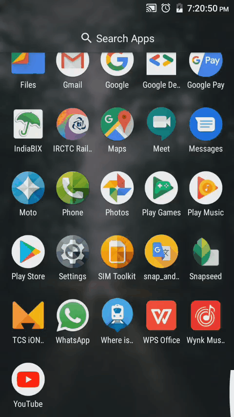

# snap-and-translate
A mobile application built using flutter to translate the text typed or text recognized from an image in to anyone of the supported 100 languages.
 
 
 

### Home and help pages

<kbd>

</kbd>
 
 
 
 

### Translate by typing or pasting text
features included
- more than 100 languages supported
- copy and paste to clipboard options to make translations easy
- text to speech option
<kbd>

</kbd>

 
 
 
 

### Translate by taking a snap using the camera

After clicking the picture it redirects to translate page and   pastes the recognized text in the text field ready to translate.
 
 
<kbd>

</kbd>

 
 
 
 

### Translate by picking an image from gallery

After selecting the picture from gallery, it redirects to translate  page and pastes the recognized text in the text field ready to translate.
 
 
<kbd>

</kbd>
